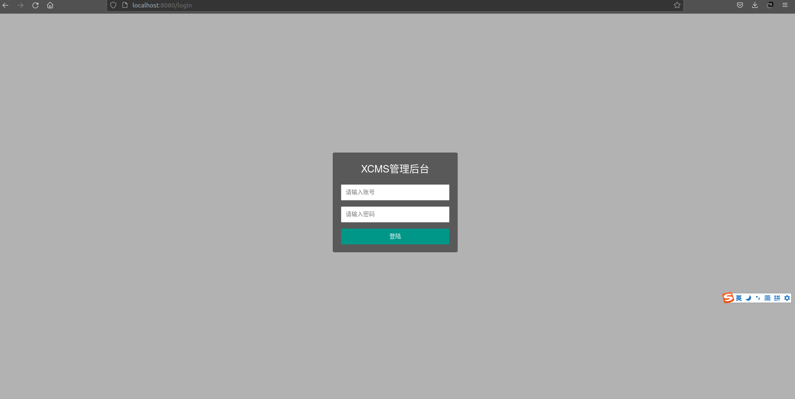
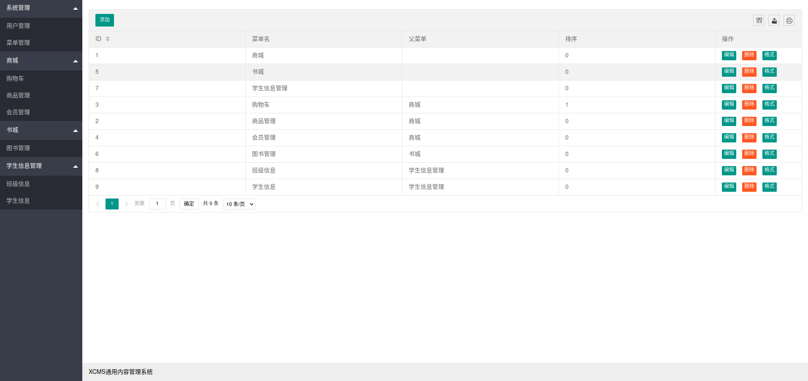

# XCMS内容管理平台  

## 涉及技术栈  

- Go  
- Beego框架  
- MySQL数据和ORM  
- 前端

## 运行  

首先默认您已经安装配置好了Go语言相关环境  

克隆项目仓库  
git clone git@github.com:OctopusLian/xcms.git  

执行go mod tidy下载相关包  
go mod tidy  

在mysql数据库中创建`defatlt`和`godb`数据库  

将static/sql/godb.sql放在mysql的godb数据库中执行  

使用bee命令运行  
bee run

打开本地端口号http://localhost:8080  

  

用户名：aa  
密码：123456  

验证成功后即可跳转  
  